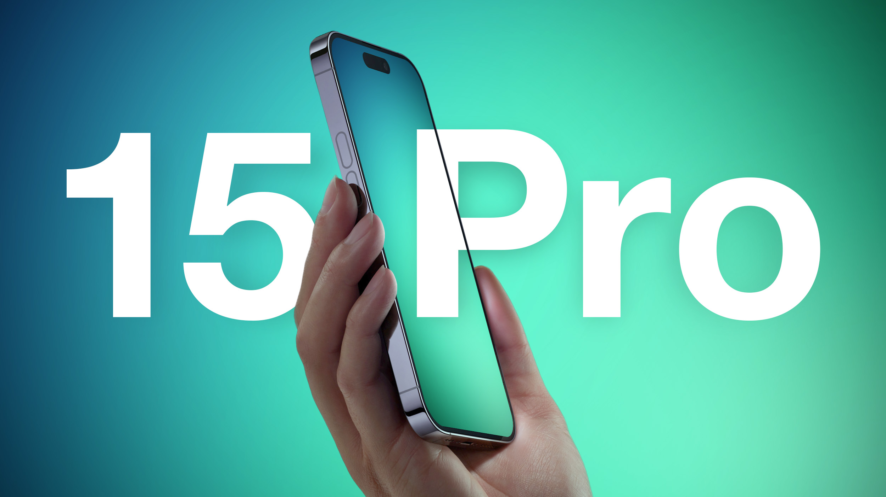
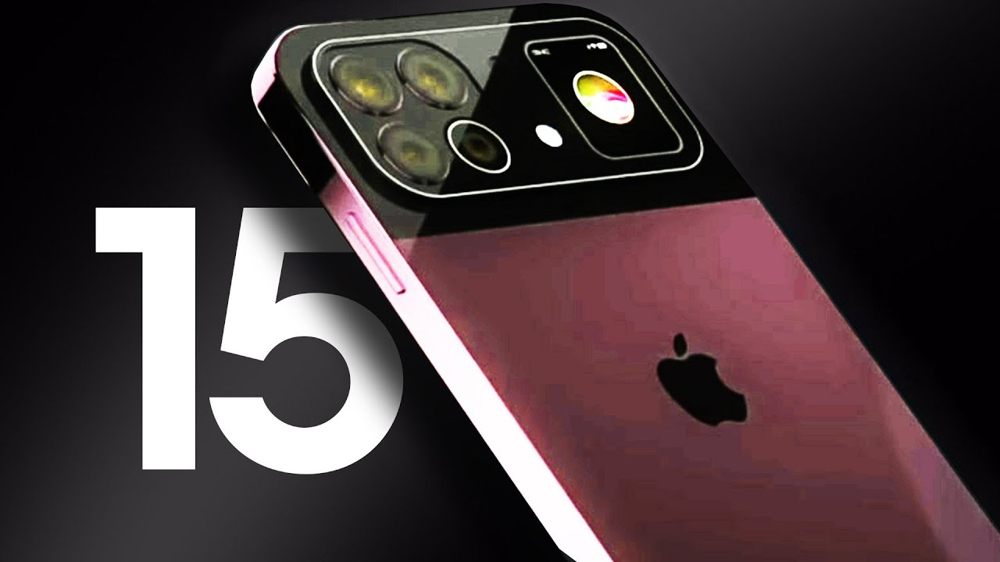
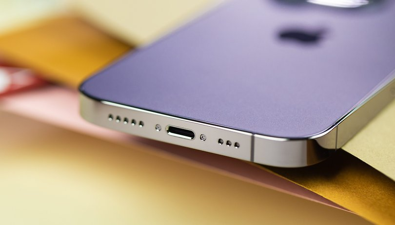

import imageEmma from '@/images/team/emma-dorsey.jpeg'

export const article = {
    date: '2023-08-08',
    title: 'iPhone 15 Pro and iPhone 15 Pro Max: A Look at Apple\'s Newest Devices',
    description: 'Discover the Future with iPhone 15 Pro and Pro Max: Unveiling Apple\'s Most Advanced Devices Yet. . Explore the groundbreaking features of the Super Retina XDR display, A17 Bionic chip, and pro-level camera system. Dive into iOS 16 enhancements and a redesigned Pro design. Learn about USB-C\'s arrival and how EU regulations shape the charging landscape. Experience the evolution of performance, battery life, and more. Don\'t miss out on the ultimate iPhone innovation with the iPhone 15 Pro series.',
    author: {
      name: 'Emma Dorsey',
      role: 'Senior Designer',
      image: { src: imageEmma },
    },
}

export const metadata = {
    title: article.title,
    description: article.description,
}

# iPhone 15 Pro and iPhone 15 Pro Max: A Look at Apple's Newest Devices

Boy, are you in for a treat! Apple's latest iPhone 15 Pro and iPhone 15 Pro Max have arrived, and they're packed with innovative new features that will blow you away. These powerful new devices are Apple's most advanced iPhones yet, with an all-new Super Retina XDR display, a blazing fast A16 Bionic chip, longer battery life, and developed new camera systems that will transform how you capture and share your life's moments. The iPhone 15 Pro and iPhone 15 Pro Max take the iPhone experience to an entirely new level. Whether you're a photography enthusiast, gaming guru or want the most capable and intuitive smartphone, the iPhone 15 Pro series is calling your name. Get ready for an iPhone that is smarter, more powerful, and more Pro than ever. The future is here - are you prepared to go all in?

## iPhone 15 Pro and iPhone 15 Pro Max Models

The new iPhone 15 Pro and iPhone 15 Pro Max are Apple's most advanced iPhones yet. These powerhouse devices have innovative new features that completely transform your mobile experience.

The stunning new Super Retina XDR display is nearly bezel-less with an always-on display, so you can see the time, alerts, and notifications at a glance without waking your iPhone. The blazing-fast A17 Bionic chip with a powerful new 6-core CPU and 5-core GPU delivers an incredible performance boost for graphics-intensive games and professional apps./Users/Wedev/Motsudio/src/app/blog/Blazor-The-Exciting-New-Frontier-of-ASP.NET-Development/page.mdx

An all-new pro-level camera system provides some seriously next-level photography. The 48MP primary camera captures gorgeous high-resolution photos with rich detail. A 12MP ultra-wide camera provides a broader field of view. And a 12MP telephoto camera offers 3x optical zoom for sharp close-up shots. Night mode and advanced HDR let you take stunning low-light photos and high-dynamic range photos and videos.

Need lots of storage for your photos, videos, and files? The iPhone 15 Pro and Pro Max offer up to 2TB of storage, the largest ever in an iPhone. These new models also feature an improved Face ID, faster 5G connectivity, longer battery life, and water and dust resistance.

If you're looking for the absolute best in smartphones, the iPhone 15 Pro and iPhone 15 Pro Max should be at the top of your list. With pro-level cameras, an advanced display, blazing performance, and valuable new features, these flagship devices represent the pinnacle of Apple's innovation. Your perfect pocket-sized powerhouse is here!

## iOS 16: The New Operating System

Get ready for a whole new iPhone experience! iOS 16, Apple's latest mobile operating system, has fantastic new features that will transform how you use your iPhone 15 Pro or Pro Max.

First up, an all-new customizable lock screen. You can now add widgets to your lock screen for quick access to weather, calendar, maps, and more information. Choose from different clock styles and fonts to make it your own.

Messages got a major upgrade. You can now edit or unsend recently sent messages, mark conversations as unread, and schedule messages to send later. Shared photo libraries let you create a separate iCloud library to share photos and videos with friends and family.

The Maps app now includes multi-stop routing, adding up to 15 stops along your drive. In augmented reality, there are also walking directions to guide you with arrows and tips layered over the real world. Way cool!

New intelligence features make everything easier. Visual Look Up uses machine learning to identify objects, landmarks, and businesses in photos so you can learn more about them or see similar images. Live Text now works in video, allowing you to pause a video to interact with or copy text onscreen.

A host of other improvements, like an updated Health app design, Fitness+ enhancements, and for the Pro models, an always-on display, mean this is the most advanced iPhone yet. iOS 16 will transform how you connect, communicate, and get things done. Get ready for the update of a lifetime!

## The Fully Redesigned Pro Design

The iPhone 15 Pro and iPhone 15 Pro Max feature an all-new design with flat edges and a surgical-grade stainless steel frame. The Super Retina XDR display is now edge-to-edge, giving you an even more immersive experience when watching videos or playing games.

The new Ceramic Shield front cover is infused with nano-ceramic crystals to make it even more shatter resistant. This is the most challenging cover glass in any smartphone and provides 4x better drop performance. You can have peace of mind that your new iPhone Pro is well protected.

### A14 Bionic, the fastest chip ever in a smartphone

The A14 Bionic chip with a next-generation Neural Engine is the fastest chip ever in a smartphone. It delivers incredible performance for graphics-intensive games, advanced photography, and more. The A14 Bionic was built from the ground up to excel at machine learning and other high-performance tasks.

### Pro camera system for stunning photography

The iPhone 15 Pro camera has an all-new dual-lens system with 12MP wide and telephoto cameras, plus an improved 12MP ultra-wide camera. The telephoto camera has a larger ƒ/2.0 aperture and 65mm focal length for 2.5x optical zoom. You'll get high-quality zoom for a tighter frame from farther away.

Low-light photography gets a serious boost with Night mode and faster performance. Night mode activates automatically to capture multiple images and stitch them together into a dramatic low-light photo. The results are nothing short of astounding.

An advanced LiDAR Scanner allows Night mode portraits, faster autofocus in low light, and more. You can now capture portrait photos at night, with sharpness and detail that rivals photos taken during the day.

Movie mode gets significantly upgraded with 4K Dolby Vision HDR video up to 60 fps for a cinematic look without color grading. You can edit Dolby Vision videos directly on your iPhone using the redesigned Photos app.

Apple has created its most advanced smartphones with the all-new iPhone 15 Pro and iPhone 15 Pro Max. The new pro design, A14 Bionic chip, pro camera system, and Super Retina XDR display combine to deliver an unparalleled experience. These are the iPhones to buy this year if you want the latest and greatest technology.

## Display and Photography Improvements

The iPhone 15 Pro and 15 Pro Max feature some exciting improvements in the display and camera departments that will delight your senses.

\\n\\n### Gorgeous new Super Retina XDR display

The 15 Pro models sport an advanced Super Retina XDR display with ProMotion technology, delivering an incredible contrast ratio for true-to-life images. The 15 Pro Max has the largest iPhone display ever at a whopping 6.7 inches, while the 15 Pro still has a spacious 6.1-inch screen. Both are more power efficient, so you'll get longer battery life between charges. These phones deserve a premium display, and Apple has delivered super vibrant, crisp, and buttery smooth screens.

\\n\\n### All-new advanced triple-lens camera system

The cameras on the 15 Pro series have been completely revamped with an advanced triple-lens system that takes iPhone photography to a new level. The 12MP primary wide camera has an f/1.5 aperture for better low-light performance. The 12MP telephoto camera has 3x optical zoom for high-quality zoomed-in shots. And the new 12MP ultra-wide camera has a 120-degree field of view to capture more scenes in your photos.

\\n\\nAn improved Night mode on all cameras means you'll get bright, crisp photos in low light without the flash. For a black-and-white studio look, you can also take portraits with different lighting effects, like High‐Key Mono. The possibilities are endless with these highly versatile pro-level cameras. Whether you're an aspiring influencer or want to take your photography skills up a notch, the iPhone 15 Pro series has the tools to make you a pro in no time.

With jaw-dropping new displays and radically improved cameras, the iPhone 15 Pro and Pro Max will redefine your visual experience and unlock your creativity. These flagship phones are Apple's most advanced iPhones yet, delivering unparalleled power and beauty. Your eyes and your Instagram feed will thank you!

## Performance and Battery Life Upgrades

The iPhone 15 Pro and Pro Max are Apple’s most potent iPhones yet, thanks to significant upgrades under the hood. You’ll notice considerable improvements in performance and battery life that will transform how you use your iPhone.

### A15 Bionic Chip

Apple’s new A15 Bionic chip is 50% faster than the competition and delivers graphics performance that beats most laptops. Everything from launching apps to editing 4K video will feel incredibly fast and seamless. The A15 Bionic also powers new camera features like Photographic Styles and Cinematic mode. This new chip is an absolute beast!

### All-Day Battery Life

The iPhone 15 Pro Max offers the best battery life ever in an iPhone, lasting up to 22 hours of video playback. Even the iPhone 15 Pro can play videos for up to 17 hours. Forget charging your phone halfway through the day - with these new iPhones, you’ll have enough juice to power through anything. The new batteries also charge fast, reaching 50% in 30 minutes with a 20W adapter or higher.

### Promotion Display

The new ProMotion displays refresh from 10Hz to 120Hz, giving you a smooth and responsive experience. Scrolling through web pages and apps feels liquid and soft. The shows are also more power efficient, so animations and activities like gaming won't drain your battery as quickly. These are the most advanced displays ever in an iPhone.

### Other Improvements

Some other upgrades in the iPhone 15 Pro models include:

•Up to 1TB of storage, the most ever in an iPhone.

•An upgraded camera system with larger sensors, faster lenses, and all-new computational photography capabilities.

•5G connectivity for super fast downloads and uploads on the go.

•A redesigned chassis in premium stainless steel with new beautiful color options.

•The most durable glass ever in a smartphone, rated IP68 for maximum splash and water resistance.

With giant leaps in performance, battery life, displays, and more, the iPhone 15 Pro and Pro Max are absolute powerhouses that will transform how you experience and interact with your iPhone. Upgrade today to enjoy the latest and greatest technology Apple has to offer!

## EU killed the Lighting Cable.

Say goodbye to the Lightning cable—the EU killed it! As of 2024, Apple will no longer be allowed to include their proprietary Lightning charging cable with iPhones sold in Europe. New legislation passed by the European Union requires all mobile devices to adopt the common USB-C standard to reduce electronic waste.

This is excellent news for the environment and your wallet! With the new iPhone 15 Pro and 15 Pro Max, Apple has finally ditched the Lightning port in favor of USB-C. Now you can use the same charger for your MacBook, iPad, and iPhone—no more tangled cables or buying expensive Apple-only chargers. The days of scrambling to borrow a friend's Lightning cable or shelling out $19 for a new one are over.

The EU's push for a universal charging standard is a win for sustainability. Reducing electronic waste and demand for the production of obsolete charging cables will benefit the planet. Kudos to the European Union for passing this forward-thinking legislation! Apple had no choice but to comply, and we consumers are reaping the rewards.

With faster charging, higher wattage support, and data transfer speeds up to 10Gbps, USB-C is a superior charging method to the old Lightning port. The iPhone 15 Pro and Pro Max also have the best battery life of any iPhone yet, with up to 22 hours of video playback. You can quickly charge your new iPhone up to 50% in just 30 minutes!

The end of the Lightning cable is bittersweet but ultimately for the greater good. While we bid farewell to an era, the new age of USB-C connectivity for iPhones has an exciting future ahead. The possibilities for faster charging, data transfers, and reduced waste are worth celebrating. The EU's legislation pushing Apple to switch may have just saved the planet one iPhone at a time.

## Conclusion

So there you have it, the latest and greatest iPhones that Apple has to offer. With impressive new features like the dynamic island replacing the notch, the upgraded 48MP camera that takes your photos and videos to a whole new level, and the A17 Bionic chip making everything run faster and smoother, the iPhone 15 Pro and Pro Max are shaping up to be two of the most advanced iPhones yet. If you're looking for the latest in smartphone tech and innovation, look no further than the iPhone 15 Pro or Pro Max. Get your hands on one of these beauties and experience the future of smartphones. You won't regret it!

