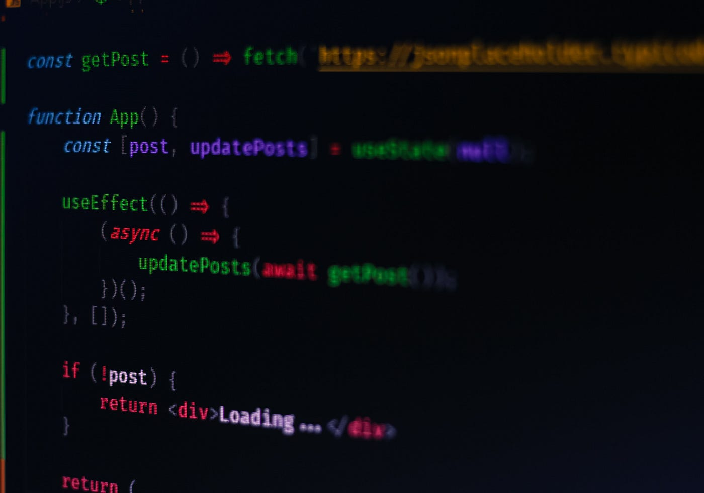

import imageAngela from '@/images/team/angela-fisher.jpeg'
import CodeBlockWithCopy from '@/components/CodeBlockWithCopy'

export const article = {
title: "Understanding Asynchronous Programming in JavaScript",
description: "A comprehensive look at asynchronous programming methods in JavaScript, from callbacks to asyncawait.",
date: "2023-08-19",
author: {
    name: 'Angela Fisher',
    role: 'Front-end Developer',
    image: { src: imageAngela, alt: 'Angela Fisher' },
  },
}
export const metadata = {
slug: "understanding-asynchronous-programming-in-javascript",
tags: ["JavaScript", "Asynchronous Programming", "Promises", "Async/Await"],
featuredImage: "/path/to/featured-image.jpg",
published: true,
lastUpdated: "2023-08-20",
summary: "An introduction to various methods of asynchronous programming in JavaScript.",
readingTime: "5 minutes",
authorBio: "Angela is a JavaScript developer with 15 years of experience...",
authorImage: "@/images/team/angela-fisher.jpeg",
canonicalUrl: "https://original-source.com/original-article",
categories: ["Web Development", "Programming"],
relatedPosts: ["iPhone-15-Pro-and-iPhone-15-Pro-Max-a-new-look", "Blazor-The-Exciting-New-Frontier-of-ASP.NET-Development"],
}

## Understanding Asynchronous Programming in JavaScript

In the synchronous world of JavaScript, each line of code is executed in order, one after the other. However, this isn't always efficient. Imagine waiting for a file to be read or an API response to return before continuing the rest of the code. This waiting can lead to a poor user experience. Enter asynchronous programming – a method that allows multiple things to happen simultaneously.

## What is Asynchronous Programming?

Asynchronous programming allows functions to run in the background and frees the main thread to execute other code. Once the background operation completes, it returns to the task it was performing and continues its process.

## Callbacks

The earliest method for asynchronous programming in JavaScript was using callbacks. A callback function gets passed as an argument to another function and is executed once its parent function has been completed.

<CodeBlockWithCopy language="javascript">
{`
function fetchData(callback) {
    // Simulating a delay using setTimeout
    setTimeout(() => {
        callback('Data fetched!');
    }, 2000);
}

fetchData(data => {
    console.log(data); // Logs 'Data fetched!' after 2 seconds
});
`}
</CodeBlockWithCopy>

However, callback functions can lead to "Callback Hell" or "Pyramid of Doom" when using multiple nested callbacks, making the code hard to read.

## Promises

To address the issues with callbacks, ES6 introduced Promises. A Promise represents a value that might be available now, in the future, or never. Promises have three states: `pending`, `fulfilled`, and `rejected`.

<CodeBlockWithCopy language="javascript">
{`
const promise = new Promise((resolve, reject) => {
    setTimeout(() => {
        resolve('Data fetched!');
    }, 2000);
});

promise.then(data => {
    console.log(data);
}).catch(error => {
    console.log(error);
});
`}
</CodeBlockWithCopy>

## Async/Await

With ES2017 (ES8), JavaScript introduced a more elegant way to handle asynchronous code – the `async/await` syntax. It makes asynchronous code look and behaves a bit more like synchronous code.

<CodeBlockWithCopy language="javascript">
{`
async function fetchData() {
    let response = await new Promise((resolve) => {
        setTimeout(() => {
            resolve('Data fetched!');
        }, 2000);
    });
    console.log(response);
}

fetchData();
`}
</CodeBlockWithCopy>

## Closing Thoughts

Asynchronous programming in JavaScript has come a long way, from callbacks to promises to async/await. Each method has its use cases and advantages. The key is understanding which tool suits the job and how to use it effectively.

